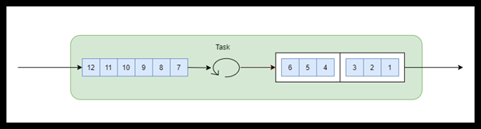
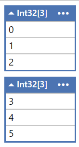

# BatchBlock\<T>

The batch block batches.



``` cs
var a = new BatchBlock<int>(3);

for (int i = 0; i < 6; i++)
{
	a.Post(i);
}

a.Receive().Dump();
a.Receive().Dump();

```

If we run this fragment in LINQPad we get

