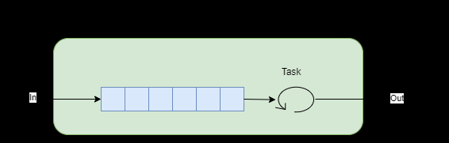

# BufferBlock\<T>
The BufferBlock is a **propagator** that provides support for **unbounded** or **bounded** **buffering** of messages of type T. Posting to the block causes values to be stored in FIFO order by the block. 



## FIFO buffering 
When we call the Post extension method on a buffer block it causes values to be stored in FIFO order. The following code posts two values into an unbounded buffer.  

```cs
var b = new BufferBlock<int>();
b.Post(1);
b.Post(2);

WriteLine(b.Receive());
WriteLine(b.Receive());
WriteLine("All received");
```

The output is 

```
1
2
All received
```

## Full bounded buffer rejects when full
If the buffer is already full then calling Post causes the buffer to reject the messags as we can see from the running the following code wich sets up a buffer with a bounded capacity of 1 and tries to post two consecutive values into it. 

``` cs
var b = new BufferBlock<int>(new DataflowBlockOptions {BoundedCapacity = 1});
WriteLine(b.Post(1));
WriteLine(b.Post(2));
```
The output is.

```
True
False
1
```

## Receive Blocks on Empty BufferBlock
Calling *Receive* on a buffer with no values is a blocking operation. Note in the below sample “All received” is never written to the console. 

**BufferBlock receive**
```cs
var b = new BufferBlock<int>();
b.Post(1);
b.Post(2);

WriteLine(b.Receive());
WriteLine(b.Receive());
WriteLine(b.Receive());
WriteLine("All received");
```

The output is

```
1
2
```

## ReceiveAsync does not block

``` cs
var b = new BufferBlock<int>();
b.Post(1);
b.Post(2);

WriteLine(b.ReceiveAsync());
WriteLine(b.ReceiveAsync());
WriteLine(b.ReceiveAsync());

WriteLine("Called ReceiveAsync 3 times");
Sleep(3000);
b.Post(3);

```

We temporarily see the following **if we run the fragment in LINQPad**

```
1
2
awaiting...
Called ReceiveAsync 3 times

```

Then the final post comes in and it changes to

```
1
2
3
Called ReceiveAsync 3 times
```

## Synchronous Producer/Consumer with BufferBlock
The following code shows how to use a BufferBlock to create a synchronous Producer/Consumer. 

``` cs
BufferBlock<int> buffer = new BufferBlock<int>();

var consumerTask = Task.Factory.StartNew(() =>
{
	while (true)
	{
		int item = buffer.Receive();
		WriteLine($"Consumed item {item}");
	}
});

var producerTask = Task.Factory.StartNew(() =>
{
	for (int i = 0; i < 10; i++)
	{
		buffer.Post(i);
		Sleep(1000);
	}
});

Task.WaitAll(consumerTask, producerTask);
```

## ASynchronous Producer/Consumer with BufferBlock
The following code shows how to use a BufferBlock to create an asynchronous Producer/Consumer. 

```cs
BufferBlock<int> buffer = new BufferBlock<int>();

var consumerTask = Task.Factory.StartNew(async () =>
{
	while(true)
	{
		int item = await buffer.ReceiveAsync();
		WriteLine($"Consumed item {item}");
	}
});

var producerTask = Task.Factory.StartNew(() =>
{
	for (int i = 0; i < 10; i++)
	{
		buffer.Post(i);
		Sleep(1000);
	}
});


Task.WaitAll(consumerTask, producerTask);

```