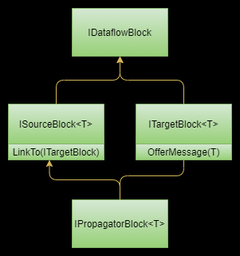

# TPL DataFlow
## Overview
**What is TPL Dataflow?**
 * Parallel stream processing library
 * Supports dataflow, pipelining, and message-passing paradigms.
 * Supports data buffering, batching and concurrent operations without locking.
 * Implemented using Tasks, concurrent collections and other TPL core types.

**When should you use TP Dataflow?**

 * System is organised around flows of data
 * Pipelining
 * High throughput, low latency demands.
 * High computational demand
 * Requirement to use multiple cores.

 **What are the key features?**
 * Data dependencies are expressed declaratively. 
 * Data is always processed asynchronously. 
 * Developers do not need to explicitly schedule tasks. 
 * Computation expressed as dataflow graph or pipeline.
 * Under the hood uses TPL tasks and concurrent collections. 
 
 **How does it differ from RX?**
 * RX composes and coordinates event streams using LINQ.
 * TDF focuses on message passing and parallelization and buffering.

## Architecture
A TPL dataflow consists of blocks that buffer, process, and propagate data. Blocks can be connected into linear sequences known as **pipelines** or graphs known as **networks**. Blocks can be either sources, targets, or both. A block that is both a source and a target is known as a propagator. The library provides multiple build-in implementations that support different scenarios. While developers can develop their own blocks, the idea is the build it blocks will cover most common scenarios. The hierarchy looks as follows. 

Sources can be linked to zero or more targets and targets can be linked from zero or more sources. This allows us to construct networks where sources automatically and asynchronously propagate data to targets. Sources are linked to target blocks using the *LinkTo* method. Sources pass data to targets by invoking the target’s *OfferMessage* method. The source and target can participate in a two-phase commit protocol

## Built-in blocks
The language provides a set of built-in blocks that are intended to cover most scenarios. These blocks handle asynchrony in a thread-safe manner so the consumer does not have to. 

> These blocks enable multiple forms of **data buffering, greedy and non-greedy receiving, joining, and batching**. 

The built-in blocks fall into one of three categories. 
 * Pure Buffering Blocks
 * Execution Blocks
 * Transform Groups    b
 * Grouping Blocks

### Buffering Blocks

 * [BufferBlock\<T>](./bufferblock.md)

 ### Transforming Blocks

  * [TransformBlock\<T>](./transformblock.md)

### Execution Blocks
  * [ExecutionBlocks\<T>](./transformblock.md)

### Combining Blocks

 * [BatchBlock\<T>](./batchblock.md)

