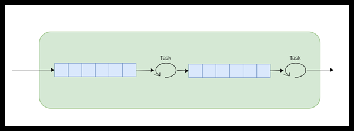

# TransformBlock\<T>
Transform blocks transforms data so it is both a source and a target. The transform buffers inputs and outputs. The output buffer behaves like a BufferBlock. 

If the transform is configured to process messages asynchronously the transformed values are still delivered to the output block in the order the input values arrived (internally uses a reordering buffer). 